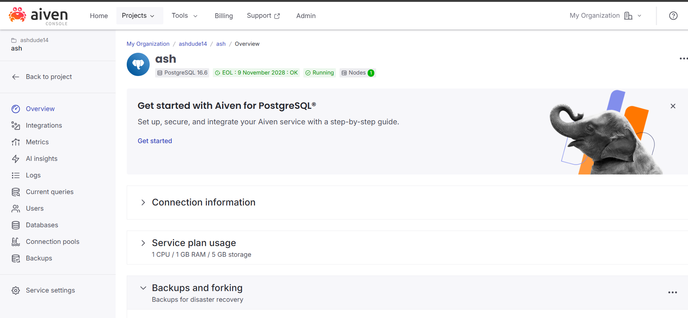
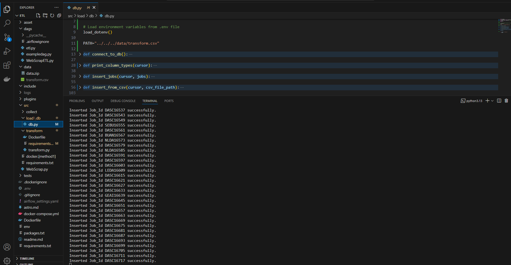
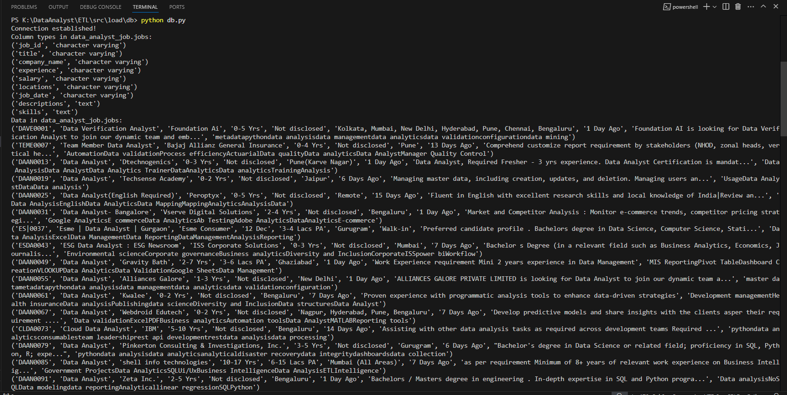
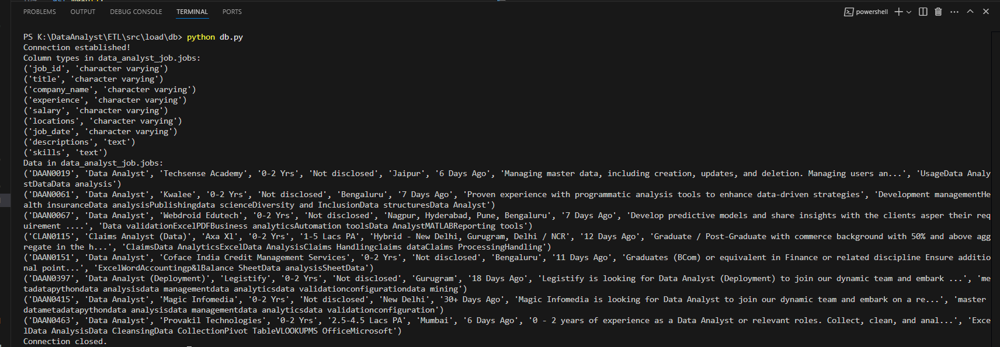
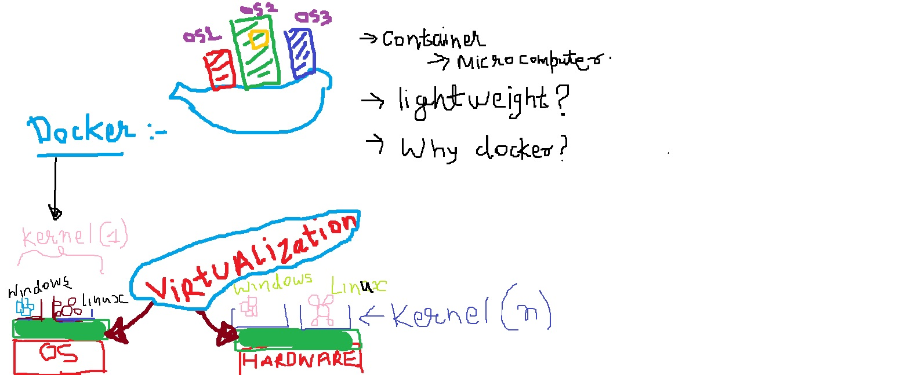
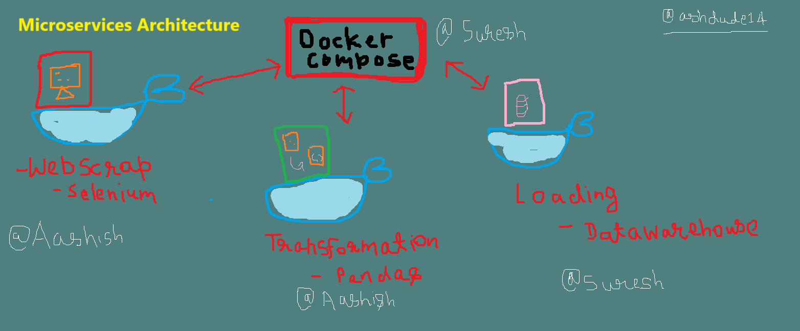

#  Automated Data Extraction, Transformation, and Loading (ETL) Pipeline with Airflow and Selenium

## Objective: Airflow is employed to run Python scripts that automate the web scraping, data transformation, and loading tasks.

- To ensure a consistent execution environment, the entire solution is containerized using Docker. Docker allows the encapsulation of all      dependencies, including the necessary libraries, the Selenium web driver, and a compatible web browser (e.g., Chrome), ensuring the system runs seamlessly across different environments. This containerized approach minimizes the risk of dependency conflicts and simplifies deployment and scaling.

- The data processing pipeline also includes a crucial deduplication step, ensuring that duplicate records are not inserted into the data warehouse, maintaining data quality. The extracted data is transformed into a structured format (such as JSON, CSV, or DataFrame) that aligns with the target data warehouse schema.

- Additionally, the project is managed using Jira, which helps in tracking progress, assigning tasks, and collaborating with other developers. This project structure ensures a scalable, maintainable, and efficient ETL pipeline with minimal manual intervention, making it suitable for automating data extraction and loading from websites on a regular basis. By leveraging Docker and Apache Airflow, this solution provides flexibility and scalability for future enhancements and integration with other data sources.


## Key Components:

### 1. Data Extraction:
 **Selenium Web Scraping** :
 
- <b>Detailed Implementation </b>. [see here](https://www.github.com/ashdude14/DA4)

- As described in the attached github repo to gather through web scraping there are mendatory steps to follow -
   
   - Download web driver for respective brower.
   - Setting up the Path for the web driver executable application and target website Url in my case it is <i>naukri.com</i>. 
   - Run the code and ensure that it should automate withouth <i>headless</i> mode.
- Here we need to customize all the steps inside the container which will increase memory overhead and execution time, also the process should only run without <i>headless option it will be somewhat complicated because to work with GUI inside the Docker container, we need to mention the ```display server``` with ```x11``` service of ```Xvfb``` library of Dockerfile. </i> To optimize this Automation of website, we are using the image which is available as ```selenium/standalone-chrome``` in <i> DockerHub<i> and this reduces the overall size of container and increases speed of execution.

- Extracted data preview -
```
Job Details
Data Verification Analyst
Foundation Ai | 2.7 | 18 Reviews
"0-5 Yrs | Not disclosed | Kolkata, Mumbai, New Delhi, Hyderabad, Pune, Chennai, Bengaluru"
Foundation AI is looking for Data Verification Analyst to join our dynamic team and emb...
metadatapythondata analysisdata managementdata analyticsdata validationconfigurationdata mining
1 Day Ago | Save
Team Member Data Analyst
Bajaj Allianz General Insurance | 3.9 | 2276 Reviews
0-4 Yrs | Not disclosed | Pune
"Comprehend customize report requirement by stakeholders (NHOD, zonal heads, vertical he..."
AutomationData validationProcess efficiencyActuarialData qualityData analyticsData AnalystManager Quality Control
13 Days Ago | Save
Data Analyst
Dtechnogenics | 4.3 | 5 Reviews
0-3 Yrs | Not disclosed | Pune(Karve Nagar)
"Data Analyst, Required Fresher - 3 yrs experience. Data Analyst Certification is mandat..."
Data AnalysisData AnalystData Analytics TrainerDataAnalyticsData analyticsTrainingAnalysis
1 Day Ago | Save
Data Analyst
Techsense Academy
0-2 Yrs | Not disclosed | Jaipur
"Managing master data, including creation, updates, and deletion. Managing users an..."
UsageData AnalystDataData analysis
6 Days Ago | Save
Data Analyst(English Required)
Peroptyx
0-5 Yrs | Not disclosed | Remote
Fluent in English with excellent research skills and local knowledge of India|Review an...
Data AnalysisEnglishData AnalyticsData MappingMappingAnalyticsAnalysisData
15 Days Ago | Save
```
### ***[Note]
- Working with ```selenium/standalone/chrome/firefox/any_browser``` needs proper attention, though I have cracked the best practices of doing this little lately after wasting many hours, including posting an ```issue``` on ```docker-selenium```. You can read it here ->  [[dockarizing-selenium-python-solution]](https://github.com/SeleniumHQ/docker-selenium/issues/2540#issuecomment-2563834846)


### 2. Data Deduplication:
- **Manual Deduplication**: Before loading the extracted data into the data warehouse, deduplication will be performed to avoid inserting duplicate records. This ensures data quality and prevents redundancy.
### 3. Data Transformation:
- **Data Structuring**: The extracted data will be transformed into a structured format (e.g., JSON, CSV, or DataFrame) that aligns with the target data warehouse schema.

    - **Data Preview**:

        | Job Id   | Title                        | Company Name                     | Experience | Salary        | Locations                                                          | Date        | Descriptions                                                                                          | Skills                                                                                       |
        |----------|------------------------------|----------------------------------|------------|---------------|--------------------------------------------------------------------|-------------|------------------------------------------------------------------------------------------------------|---------------------------------------------------------------------------------------------|
        | DAVE0001 | Data Verification Analyst    | Foundation AI                   | 0-5 Yrs    | Not disclosed | Kolkata, Mumbai, New Delhi, Hyderabad, Pune, Chennai, Bengaluru   | 1 Day Ago  | Foundation AI is looking for Data Verification Analyst to join our dynamic team and emb...       | metadatapythondata analysisdata managementdata analyticsdata validationconfigurationdata mining |
        | TEME0007 | Team Member Data Analyst     | Bajaj Allianz General Insurance | 0-4 Yrs    | Not disclosed | Pune                                                               | 13 Days Ago | Comprehend customize report requirement by stakeholders (NHOD, zonal heads, vertical he... | AutomationData validationProcess efficiencyActuarialData qualityData analyticsData AnalystManager Quality Control |
        | DAAN0013 | Data Analyst                 | Dtechnogenics                   | 0-3 Yrs    | Not disclosed | Pune(Karve Nagar)                                                  | 1 Day Ago  | Data Analyst, Required Fresher - 3 yrs experience. Data Analyst Certification is mandat... | Data AnalysisData AnalystData Analytics TrainerDataAnalyticsData analyticsTrainingAnalysis |
        | DAAN0019 | Data Analyst                 | Techsense Academy               | 0-2 Yrs    | Not disclosed | Jaipur                                                             | 6 Days Ago  | Managing master data, including creation, updates, and deletion. Managing users an...       | UsageData AnalystDataData analysis                                                           |
                                              

      

### 4. Data Loading:
- **Database Interaction**: The structured data  loaded into a SQL-based data warehouse, here using Postgres server. [```endpoints``` and ```queires``` to interact with this database  will be published after some time.]

- Using Postgres service free tier provided by ```aiven```, console snapshot 

    

- Connection made using ```python```
 ```python
 
def connect_to_db():
    try:
        # Retrievinge database URL from environment variables
        database_url = os.getenv("DB_URL")
        if not database_url:
            raise ValueError("DATABASE_URL is not set in the environment.")
        
        # Connecting the database
        conn = psycopg.connect(database_url)
        print("Connection established!")
        return conn
    except Exception as e:
        print(f"Error connecting to the database: {e}")
        return None


 ```
 - Data Insertion log -
     function to insert data from csv file to Postgres server

    ```python
        
    def insert_from_csv(cursor, csv_file_path):
        """
        Insert data from a CSV file into the database, ensuring no duplicate Job_Id values.
        :param cursor: Database cursor
        :param csv_file_path: Path to the CSV file
        """
        try:
            with open(csv_file_path, mode="r", encoding="utf-8") as csv_file:
                csv_reader = csv.DictReader(csv_file) 
                
                # Iterate over each row in the CSV
                for row in csv_reader:
                    job_id = row.get("Job Id")
                    title = row.get("Title")
                    company_name = row.get("Company Name")
                    experience = row.get("Experience")
                    salary = row.get("Salary")
                    locations = row.get("Locations")
                    job_date = row.get("Date")
                    descriptions = row.get("Descriptions")
                    skills = row.get("Skills")

                    # Check if the Job_Id already exists
                    check_query = "SELECT COUNT(*) FROM data_analyst_job.jobs WHERE Job_Id = %s"
                    cursor.execute(check_query, (job_id,))
                    exists = cursor.fetchone()[0] > 0

                    if exists:
                        print(f"Skipping Job_Id {job_id}: already exists.")
                        continue  

                    # Insert the new row into the table
                    insert_query = """
                    INSERT INTO data_analyst_job.jobs 
                    (Job_Id, Title, Company_Name, Experience, Salary, Locations, Job_Date, Descriptions, Skills)
                    VALUES (%s, %s, %s, %s, %s, %s, %s, %s, %s);
                    """
                    try:
                        cursor.execute(
                            insert_query,
                            (job_id, title, company_name, experience, salary, locations, job_date, descriptions, skills),
                        )
                        print(f"Inserted Job_Id {job_id} successfully.")
                    except UniqueViolation:
                        print(f"Job_Id {job_id} caused a unique constraint violation. Skipping.")
        except Exception as e:
            print(f"Error processing the CSV file: {e}")

    ```
   - log [snapshot] - 
   
     

   - SELECTing data with the help of command ```SELECT * FROM data_analyst_job.jobs ``` log -

     

    - Filter command to show job with 0-2 yrs experience log -
      

    -  ```SELECT * FROM data_analyst_job.jobs WHERE experience = %s", ("0-2 Yrs",)) ``` 

### 5. Airflow Orchestration:
- **DAG Creation**: A Directed Acyclic Graph (DAG) will be created within Apache Airflow to schedule and automate the ETL pipeline. The DAG will be configured to run weekly and trigger the Python script that performs the data extraction, transformation, and loading.
- **PythonOperator**: The PythonOperator in Airflow will be used to execute the Python script that automates the website interaction and data processing.

### 6. Containerization:
- **Dockerization**: To ensure a consistent and isolated execution environment, Docker will be used to containerize the entire solution. This includes packaging the necessary libraries, the Selenium web driver, and other dependencies within the Docker container.
    - Why Docker??
    
     

- **Web Browser and Web Driver**: The Docker container will also include a compatible web browser (e.g., Chrome) and its corresponding web driver, ensuring compatibility with Selenium.

### 7. Project Management:
- **Jira**: Jira will be used as a project management tool to track progress, assign tasks, and collaborate with other developers on the project. This ensures that the development process remains organized and transparent.


## Architecture:



## Technical Stack:
- **Python** for scripting and automation
- **Selenium** for web scraping
- **Apache Airflow** for orchestration and scheduling
- **Docker** for containerization
- **SQL Server/Postgres** for the data warehouse
- **Jira** for project management and team collaboration

## Workflow:
1. **Data Extraction**: The data is scraped from the website using Selenium.
2. **Data Deduplication**: The extracted data is deduplicated to remove any redundancy.
3. **Data Transformation**: The data is transformed into a structured format suitable for database storage.
4. **Data Loading**: The transformed data is inserted into the data warehouse.
5. **Airflow Scheduling**: The ETL process is scheduled and automated using Airflow to run weekly.
6. **Containerization**: The entire process is containerized using Docker, with all dependencies and tools bundled in a single image.

## Deliverables:
- A fully functional ETL pipeline with automated web scraping.
- Docker container with all dependencies and web drivers.
- A scheduled Airflow DAG for automation.
- A project management plan with tasks tracked via Jira.

